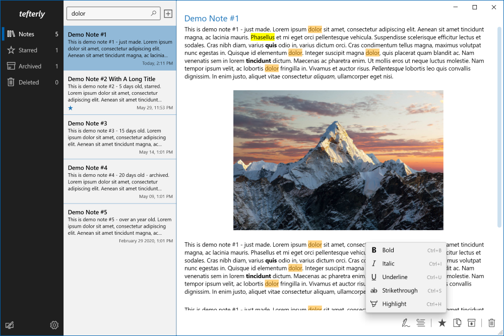

# tefterly
References:
- Brian Lagunas - PrismOutlook tutorial: https://github.com/brianlagunas/PrismOutlook

Project updates:
- 03/12/2021
  - Main project created, UI mock in progress
- 03/15/2021
  - Navigation bar UI mock complete
- 03/21/2021
  - Notes list UI mock complete 
- 03/27/2021
  - Note UI mock complete
- 04/05/2021
  - Note service added
- 04/10/2021
  - Navigation across notebook/notes/note complete
  - Added flow document bound richtextbox
- 04/17/2021
  - Implemented most of the note actions
- 04/24/2021
  - All note actions implemented
- 05/02/2021
  - Note font/paragraph styles implemented.
  - Global font/paragraph styles commands added to NoteEditor control
- 05/07/2021
  - Refactored the Note model
  - Optimized the navigation action in Notes module
- 05/08/2021
  - Add new note implemented
- 05/16/2021
  - Refactored NoteViewModel bindings to properly reflect changes to the model values
  
Screenshot:
